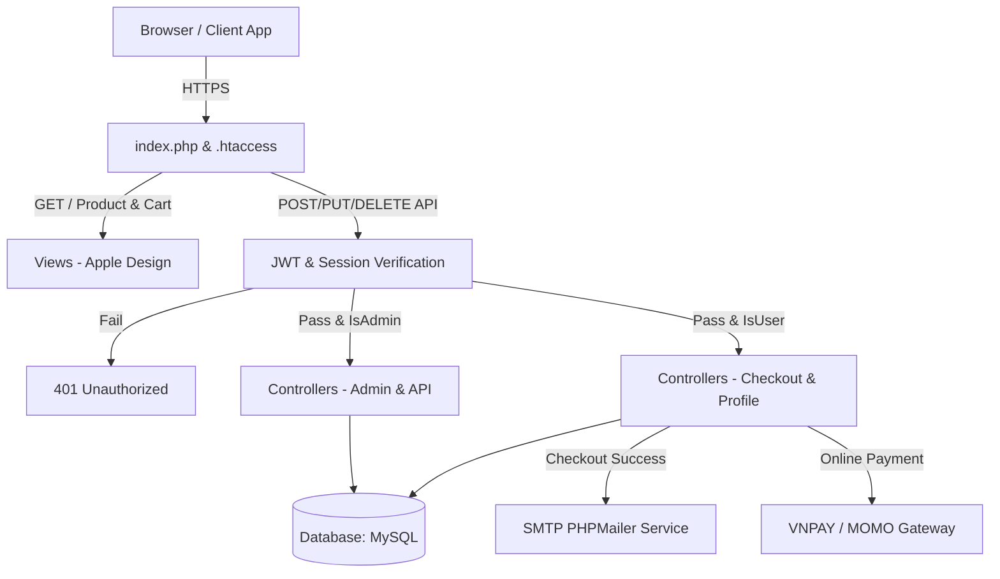
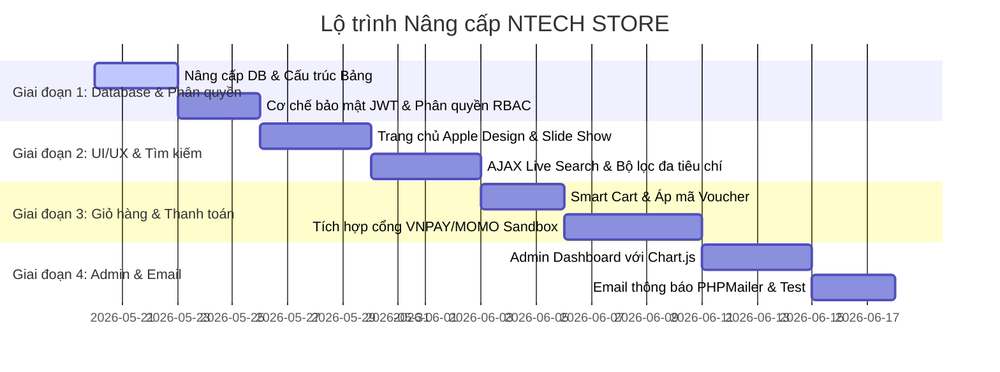

# KẾ HOẠCH NÂNG CẤP DỰ ÁN NTECH STORE THÀNH WEBSITE BÁN HÀNG CHUYÊN NGHIỆP

Tài liệu này vạch ra lộ trình chi tiết để nâng cấp dự án từ một trang web bán hàng mẫu (assignment/lab) thành một hệ thống thương mại điện tử thực tế, bảo mật, tối ưu SEO và hỗ trợ đầy đủ luồng nghiệp vụ kinh doanh trực tuyến.

---

## 🎯 Mục tiêu nâng cấp
1. **Hoàn thiện luồng nghiệp vụ**: Quản lý kho hàng thực tế, thanh toán online (VNPAY/MOMO), mã giảm giá (Voucher), đánh giá sản phẩm và thông báo qua Email.
2. **Nâng cao bảo mật**: Áp dụng phân quyền chặt chẽ (RBAC) cho cả giao diện và RESTful API bằng JWT, ngăn chặn hoàn toàn các lỗ hổng XSS, CSRF và SQL Injection.
3. **Tối ưu trải nghiệm khách hàng (UI/UX)**: Giao diện Apple Premium Design (Liquid Glass) tinh tế, tìm kiếm nhanh gợi ý thông minh (AJAX search), trang chủ sinh động với banner quảng cáo và bộ lọc đa tiêu chí.
4. **Trang quản trị (Admin Dashboard) chuyên nghiệp**: Thống kê doanh thu, đơn hàng bằng biểu đồ trực quan và quản lý quy trình xử lý đơn hàng.

---

## 📂 Sơ đồ kiến trúc cải tiến



---

## 🛠️ Chi tiết các hạng mục nâng cấp

### 1. Nâng cấp và Tối ưu hóa Cơ sở dữ liệu (Database Schema Refactoring)

Để phục vụ các tính năng thương mại điện tử thực tế, cấu trúc DB hiện tại cần được nâng cấp qua việc thêm các trường quản lý kho, giá khuyến mãi và các bảng mới cho mã giảm giá, đánh giá và đa ảnh sản phẩm.

```sql
-- Thêm các cột mới vào bảng Product
ALTER TABLE product ADD COLUMN slug VARCHAR(255) UNIQUE AFTER name;
ALTER TABLE product ADD COLUMN stock INT DEFAULT 0 AFTER price;
ALTER TABLE product ADD COLUMN sale_price DECIMAL(10, 2) DEFAULT NULL AFTER price;
ALTER TABLE product ADD COLUMN brand VARCHAR(50) DEFAULT NULL AFTER category_id;
ALTER TABLE product ADD COLUMN is_featured TINYINT(1) DEFAULT 0 AFTER category_id;

-- Tạo bảng quản lý đa hình ảnh (Product Gallery)
CREATE TABLE IF NOT EXISTS product_images (
    id INT AUTO_INCREMENT PRIMARY KEY,
    product_id INT NOT NULL,
    image_path VARCHAR(255) NOT NULL,
    FOREIGN KEY (product_id) REFERENCES product(id) ON DELETE CASCADE
) ENGINE=InnoDB DEFAULT CHARSET=utf8mb4 COLLATE=utf8mb4_unicode_ci;

-- Cập nhật bảng Orders (Liên kết User, Trạng thái đơn, Phương thức thanh toán)
ALTER TABLE orders ADD COLUMN account_id INT DEFAULT NULL AFTER id;
ALTER TABLE orders ADD COLUMN status VARCHAR(50) DEFAULT 'pending' AFTER address;
-- Trạng thái đơn hàng: pending (Chờ duyệt), processing (Đang xử lý), shipping (Đang giao), completed (Đã giao), cancelled (Đã hủy)
ALTER TABLE orders ADD COLUMN payment_method VARCHAR(50) DEFAULT 'COD' AFTER status; -- COD, VNPAY, MOMO
ALTER TABLE orders ADD COLUMN payment_status VARCHAR(50) DEFAULT 'unpaid' AFTER payment_method; -- unpaid, paid
ALTER TABLE orders ADD COLUMN shipping_fee DECIMAL(10, 2) DEFAULT 0.00 AFTER payment_status;
ALTER TABLE orders ADD COLUMN discount_amount DECIMAL(10, 2) DEFAULT 0.00 AFTER shipping_fee;
ALTER TABLE orders ADD CONSTRAINT fk_orders_account FOREIGN KEY (account_id) REFERENCES account(id) ON DELETE SET NULL;

-- Tạo bảng Mã giảm giá (Vouchers)
CREATE TABLE IF NOT EXISTS vouchers (
    id INT AUTO_INCREMENT PRIMARY KEY,
    code VARCHAR(50) NOT NULL UNIQUE,
    discount_type ENUM('percentage', 'fixed') NOT NULL,
    discount_value DECIMAL(10,2) NOT NULL,
    min_order_value DECIMAL(10,2) DEFAULT 0.00,
    expiry_date DATETIME NOT NULL,
    usage_limit INT DEFAULT 100,
    used_count INT DEFAULT 0
) ENGINE=InnoDB DEFAULT CHARSET=utf8mb4 COLLATE=utf8mb4_unicode_ci;

-- Tạo bảng Đánh giá sản phẩm (Reviews)
CREATE TABLE IF NOT EXISTS reviews (
    id INT AUTO_INCREMENT PRIMARY KEY,
    product_id INT NOT NULL,
    account_id INT NOT NULL,
    rating INT NOT NULL CHECK (rating >= 1 AND rating <= 5),
    comment TEXT,
    created_at TIMESTAMP DEFAULT CURRENT_TIMESTAMP,
    FOREIGN KEY (product_id) REFERENCES product(id) ON DELETE CASCADE,
    FOREIGN KEY (account_id) REFERENCES account(id) ON DELETE CASCADE
) ENGINE=InnoDB DEFAULT CHARSET=utf8mb4 COLLATE=utf8mb4_unicode_ci;

-- Tạo bảng lưu trữ Giỏ hàng trong DB (đồng bộ khi User đổi thiết bị)
CREATE TABLE IF NOT EXISTS cart (
    id INT AUTO_INCREMENT PRIMARY KEY,
    account_id INT NOT NULL,
    product_id INT NOT NULL,
    quantity INT NOT NULL DEFAULT 1,
    FOREIGN KEY (account_id) REFERENCES account(id) ON DELETE CASCADE,
    FOREIGN KEY (product_id) REFERENCES product(id) ON DELETE CASCADE
) ENGINE=InnoDB DEFAULT CHARSET=utf8mb4 COLLATE=utf8mb4_unicode_ci;
```

---

### 2. Nâng cấp Backend & Định tuyến (Routing/Security)

#### A. Định tuyến thân thiện SEO (Slug-based Routing)
*   **Mục tiêu**: Thay đổi URL từ dạng `/Product/show/1` thành dạng `/san-pham/iphone-15-pro-max-256gb`.
*   **Thực hiện**:
    *   Cập nhật quy tắc `.htaccess` để bắt cụm từ `/san-pham/(.*)` và trỏ về `index.php?url=Product/detailBySlug/$1`.
    *   Thêm phương thức `detailBySlug($slug)` trong `ProductController` để truy vấn CSDL theo slug thay cho ID.
    *   Viết hàm tự động tạo slug không dấu từ tên sản phẩm khi Admin tạo/cập nhật sản phẩm.

#### B. Phân quyền và Bảo mật dựa trên vai trò (RBAC)
*   **Xác thực API an toàn**: Cập nhật hàm `authenticate()` trong `ProductApiController` để kiểm tra thuộc tính `role` trong payload của JWT Token.
    *   Nếu role của Token không phải `admin`, hệ thống sẽ chặn và trả về lỗi `403 Forbidden` đối với các phương thức `POST`, `PUT`, `DELETE`.
*   **Bảo mật View (Giao diện web)**:
    *   Sử dụng `SessionHelper::isAdmin()` để ẩn/hiện hoặc chặn truy cập các URL quản trị: `/Product/add`, `/Product/edit`, `/Category/list`, `/Category/add`. Chỉ tài khoản có `role = 'admin'` mới truy cập được các route này.
    *   Người dùng đăng nhập thông thường (`role = 'user'`) chỉ có quyền xem sản phẩm, mua hàng và truy cập trang cá nhân.

#### C. Chống tấn công lỗ hổng phổ biến (XSS, CSRF, SQL Injection)
*   **CSRF Protection**: Sinh mã token ngẫu nhiên lưu vào `$_SESSION['csrf_token']` và chèn vào thẻ `<input type="hidden" name="csrf_token" value="...">` ở tất cả các biểu mẫu (Form đăng ký, thanh toán, sửa sản phẩm). Kiểm tra tính khớp nhau của token trong các hàm POST xử lý.
*   **XSS Filter**: Sử dụng `htmlspecialchars()` khi hiển thị dữ liệu ra màn hình. Khi lưu nội dung mô tả chi tiết sản phẩm (sẽ dùng mã HTML từ editor), sử dụng thư viện lọc HTML an toàn để loại bỏ các thẻ `<script>`, `onload`, `onerror`.
*   **SQL Injection**: Đảm bảo 100% các câu truy vấn sử dụng PDO Parameter Binding (như đã triển khai ở Sprint 2). Không nối chuỗi biến trực tiếp vào chuỗi SQL.

---

### 3. Nâng cấp Giao diện Frontend (Apple Premium Design / UX)

#### A. Trang chủ (Home Page)
*   **Banner quảng cáo động**: Tích hợp một slideshow mượt mà hiển thị các sản phẩm hot đang mở bán hoặc chương trình flash sale.
*   **Bố cục lưới sản phẩm phân loại**: Chia trang chủ thành các nhóm sản phẩm cụ thể như:
    *   *Sản phẩm nổi bật (Featured)*: Được đề cử từ admin.
    *   *Sản phẩm mới nhất (New Arrivals)*: Tự động xếp theo ngày đăng giảm dần.
    *   *Sản phẩm đang giảm giá (Hot Deals)*: Hiển thị nhãn giảm phần trăm cụ thể (so sánh giữa `price` và `sale_price`).

#### B. Tìm kiếm thời gian thực (AJAX Autocomplete Search) & Bộ lọc (Filters)
*   **Tìm kiếm thông minh**: Khi người dùng gõ vào thanh tìm kiếm, hệ thống sẽ thực hiện gọi Fetch API ngầm đến `/api/product?search=keyword` và hiển thị danh sách gợi ý kèm ảnh nhỏ dưới thanh tìm kiếm ngay lập tức (không cần load lại trang).
*   **Bộ lọc thuộc tính**: Tạo thanh Sidebar bên trái danh sách sản phẩm hỗ trợ lọc đồng thời nhiều tiêu chí:
    *   *Bộ lọc theo Hãng sản xuất (Brand)*.
    *   *Bộ lọc theo khoảng giá* (Dưới 10tr, 10tr - 20tr, Trên 20tr).
    *   *Bộ lọc trạng thái*: Còn hàng / Xem tất cả.
    *   *Sắp xếp sản phẩm*: Giá tăng dần, Giá giảm dần, Mới nhất, Bán chạy nhất.

#### C. Trang chi tiết sản phẩm (Product Detail Page)
*   **Thư viện ảnh sản phẩm (Gallery)**: Hiển thị ảnh chính kích thước lớn cùng các thumbnail ảnh phụ bên dưới. Rê chuột lên ảnh chính hỗ trợ zoom chi tiết sản phẩm.
*   **Thông số kỹ thuật (Specifications)**: Tạo bảng so sánh thông số kỹ thuật rõ ràng.
*   **Hệ thống Đánh giá (Customer Reviews)**:
    *   Hiển thị điểm đánh giá trung bình (ví dụ: 4.5/5 ⭐ từ 12 lượt đánh giá).
    *   Form gửi đánh giá chỉ hiển thị cho khách hàng đã từng mua sản phẩm này (kiểm tra trạng thái đơn hàng `completed` của user trong DB).
*   **Nghiệp vụ Mua hàng**: Có 2 tuỳ chọn:
    *   *Nút "Mua ngay"*: Thêm vào giỏ hàng và chuyển trực tiếp đến trang Thanh toán.
    *   *Nút "Thêm vào giỏ"*: Thêm sản phẩm bằng AJAX kèm hiệu ứng bay vào giỏ hàng trên Header, không tải lại trang.

---

### 4. Nghiệp vụ Bán hàng Thực tế & Tích hợp Thanh toán trực tuyến

#### A. Giỏ hàng lưu trữ thông minh (Smart Cart)
*   Khi khách hàng chưa đăng nhập: Giỏ hàng được quản lý lưu trữ tạm thời tại Session/LocalStorage.
*   Khi khách hàng đăng nhập thành công: Thực hiện đồng bộ các sản phẩm từ Session/LocalStorage vào bảng `cart` trong CSDL của tài khoản để lưu trữ vĩnh viễn (giữ nguyên giỏ hàng khi người dùng chuyển từ điện thoại sang máy tính).

#### B. Áp dụng mã giảm giá (Vouchers)
*   Tại màn hình thanh toán, khách hàng nhập mã Voucher.
*   Sử dụng Fetch API gửi mã lên server kiểm tra:
    *   Mã có tồn tại và còn hạn sử dụng không?
    *   Đơn hàng có đạt giá trị tối thiểu không?
    *   Số lượng sử dụng tối đa của voucher có còn không?
*   Nếu hợp lệ, hiển thị số tiền được giảm trực tiếp trên giao diện tóm tắt đơn hàng và lưu thông tin giảm giá vào bảng `orders`.

#### C. Tích hợp cổng thanh toán online (VNPAY / MOMO)
*   **Tích hợp VNPAY Sandbox**:
    1.  Người dùng tại bước checkout chọn phương thức thanh toán **"Thanh toán qua thẻ ATM/Internet Banking (VNPAY)"**.
    2.  Hệ thống xử lý lưu đơn hàng ở trạng thái `pending` với phương thức thanh toán là `VNPAY`, đồng thời tạo link thanh toán gửi yêu cầu sang cổng VNPAY Sandbox theo tài khoản test.
    3.  Khách hàng thực hiện thanh toán giả lập trên trang của VNPAY.
    4.  VNPAY redirect khách hàng về trang `Product/orderConfirmation` trên website của chúng ta kèm mã kết quả thanh toán.
    5.  Hệ thống viết API callback (IPN URL) để nhận dữ liệu kiểm tra giao dịch từ VNPAY gửi về ngầm, nếu thành công thì cập nhật đơn hàng thành `status = 'processing'` và `payment_status = 'paid'`.
    6.  Trang xác nhận đơn hàng hiển thị trạng thái thanh toán thành công.

---

### 5. Trang cá nhân và Theo dõi đơn hàng (Customer Dashboard)

*   **Lịch sử mua hàng**: Thiết kế màn hình liệt kê toàn bộ đơn hàng của khách hàng (lọc theo trạng thái đơn hàng).
*   **Chi tiết đơn hàng & Theo dõi trạng thái**:
    *   Hiển thị tiến trình xử lý đơn hàng trực quan (Đã đặt -> Đã xác nhận -> Đang giao -> Hoàn thành) bằng sơ đồ thanh trạng thái (timeline bar).
    *   Cho phép khách hàng thực hiện nút **"Hủy đơn hàng"** khi đơn hàng ở trạng thái `pending`. Khi hủy đơn hàng, cập nhật lại số lượng tồn kho sản phẩm (`stock`).

---

### 6. Trang quản trị toàn diện (Admin Dashboard Portal)

Để tối ưu vận hành, cần xây dựng một giao diện quản trị Admin riêng biệt không chồng chéo với giao diện khách hàng.

*   **Hệ thống thống kê trực quan (Visual Reports)**:
    *   Hiển thị các thẻ chỉ số chính: Tổng doanh thu, Số đơn hàng mới, Số khách hàng đăng ký mới, Số sản phẩm hết hàng.
    *   Tích hợp thư viện **Chart.js** vẽ biểu đồ đường biểu diễn doanh thu 30 ngày gần nhất và biểu đồ cột biểu diễn số lượng bán của các danh mục.
*   **Duyệt và xử lý đơn hàng (Order Fulfillment)**:
    *   Màn hình danh sách đơn hàng lọc theo các trạng thái.
    *   Admin click xem chi tiết thông tin giao hàng, danh sách sản phẩm khách chọn.
    *   Cung cấp nút chuyển đổi trạng thái đơn hàng: Chờ duyệt ➡️ Đang giao ➡️ Đã giao (hoặc Huỷ).
*   **Trình soạn thảo soạn bài mô tả (WYSIWYG Editor)**:
    *   Tích hợp **CKEditor 5** hoặc **TinyMCE** vào trang Thêm/Sửa sản phẩm để Admin có thể chèn bảng biểu, định dạng văn bản in đậm/nghiêng và tô màu mô tả sản phẩm bắt mắt thay vì gõ text thuần.

---

### 7. Hệ thống Email Thông báo Tự động (PHPMailer SMTP Services)

*   **Tích hợp PHPMailer**: Cài đặt thư viện qua Composer (`phpmailer/phpmailer`).
*   **Cấu hình SMTP**: Sử dụng SMTP Server của Gmail để gửi thư tự động một cách tin cậy.
*   **Quy trình gửi Email tự động**:
    *   *Email xác nhận đơn hàng*: Ngay sau khi đặt hàng thành công, hệ thống gửi email HTML chứa bảng chi tiết sản phẩm đã mua, địa chỉ nhận và tổng tiền thanh toán để khách lưu trữ.
    *   *Email cập nhật trạng thái vận chuyển*: Gửi thông báo tự động khi Admin chuyển trạng thái sang `shipping` (Đang giao hàng).
    *   *Email cảm ơn & đánh giá*: Gửi sau khi đơn hàng được đánh dấu `completed` để khuyến khích khách hàng quay lại đánh giá sản phẩm lấy điểm tích luỹ.

---

## 📈 Lộ trình triển khai đề xuất (Roadmap)

Kế hoạch nâng cấp được chia làm 4 giai đoạn cụ thể để đảm bảo chất lượng kiểm thử:



---

## 🧪 Kế hoạch Kiểm thử & Đánh giá (Testing Plan)

1.  **Kiểm thử chức năng (Functional Testing)**:
    *   *Kiểm tra luồng đặt hàng*: Đặt hàng không đăng nhập ➡️ Đăng nhập đồng bộ giỏ hàng ➡️ Áp dụng voucher ➡️ Thanh toán VNPAY thành công ➡️ Kiểm tra cập nhật DB (kho hàng giảm đi, đơn hàng chuyển trạng thái).
    *   *Kiểm tra kho hàng*: Thử đặt mua số lượng vượt quá `stock` trong kho hàng và xác minh hệ thống báo lỗi không cho phép.
2.  **Kiểm thử bảo mật (Security Testing)**:
    *   Đăng nhập tài khoản Customer thông thường, lấy token JWT rồi gửi request `DELETE` đến `/api/product/1` xem hệ thống có trả về lỗi `403 Forbidden` hay không.
    *   Thử chèn mã javascript `<script>alert('hack')</script>` vào ô đánh giá sản phẩm để xem hệ thống có lọc sạch mã độc (XSS) hay không.
3.  **Kiểm thử hiệu năng & phản hồi**:
    *   Kiểm tra tốc độ tải trang chủ khi hiển thị hình ảnh tối ưu hoá (WebP, lazy loading) trên các công cụ như PageSpeed Insights.
